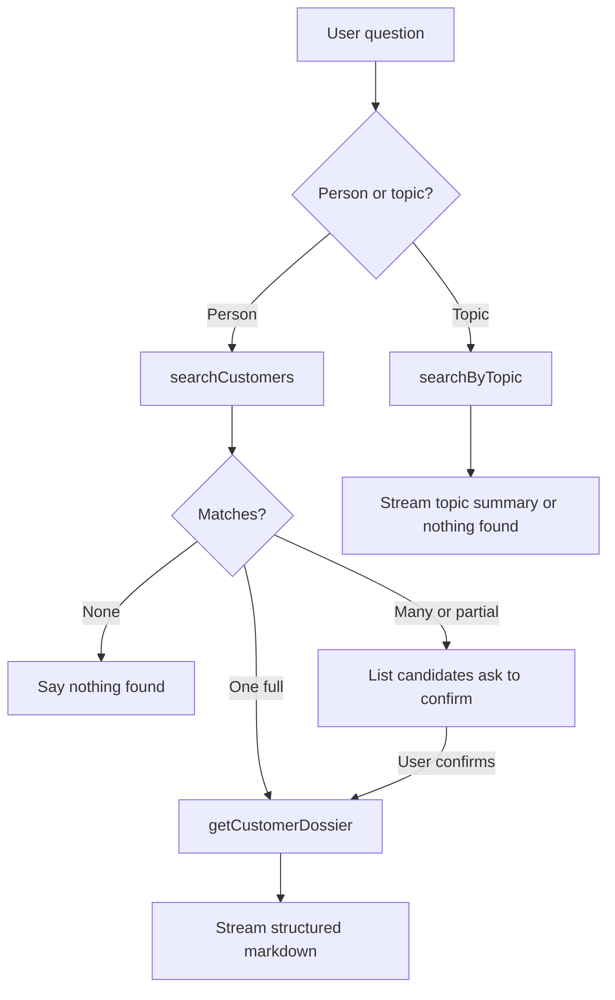

# Agent loop

The chat route runs GPT-4o in an **agentic tool loop** via the Vercel AI SDK (`streamText` + tools). There is no visible chain-of-thought; the model chooses tools, receives results, and then streams markdown.

## System rules (summary)

From `app/api/chat/route.ts`:

- Answer **only** from tool results — never invent customers, invoices, or incidents.
- Person questions → `searchCustomers`, then `getCustomerDossier` only for a clear **full** match.
- Multiple or **partial** matches → list candidates and ask for confirmation before loading a dossier.
- Topic questions → `searchByTopic`.
- Structure summaries with identity, subscriptions, invoices, equipment, incidents, and support notes when available.
- If nothing matches, say so clearly.

## Tools available to the model

| Tool | When to use |
| --- | --- |
| `searchCustomers` | User asks about a person (name or email) |
| `getCustomerDossier` | After a confirmed / full customer match |
| `searchByTopic` | Plans, incidents, equipment, invoices, support notes |

See [Tools reference](../database/tools.md) for inputs, outputs, and limits.

## Step limit

```text
stopWhen: stepCountIs(5)
```

The loop stops after five model steps. If tools ran but no text was produced, the UI shows a fallback from `lib/messages.ts` (`EMPTY_ASSISTANT_FALLBACK`).

## Decision tree



## Example traces

### Eleanor Shellstrop (full match)

| Step | Action | Result |
| --- | --- | --- |
| 1 | `searchCustomers("Eleanor Shellstrop")` | One match, `match: "full"` |
| 2 | `getCustomerDossier(id)` | Subscriptions, invoices, incidents, etc. |
| 3 | Generate summary | Markdown with headings and bullets |

### Madam Peterson (no match)

| Step | Action | Result |
| --- | --- | --- |
| 1 | `searchCustomers("Peterson")` | `{ matches: [] }` |
| 2 | Generate answer | “No matching records found” |

### Ambiguous name

| Step | Action | Result |
| --- | --- | --- |
| 1 | `searchCustomers("Smith")` | Multiple / partial matches |
| 2 | Ask user to clarify | No dossier loaded yet |
| 3 | After confirmation | `getCustomerDossier` then summary |

### Unpaid invoices (topic)

| Step | Action | Result |
| --- | --- | --- |
| 1 | `searchByTopic("unpaid")` | Matching invoices (and related tables) |
| 2 | Generate summary | Structured topic answer |
