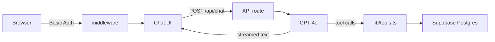

# Architecture overview

DataChat is a single **Next.js App Router** project: React UI + API routes.

## System diagram

## Key principles

1. **Browser never talks to Supabase.** All CRM reads go through `/api/chat` and server-side tools.
2. **Secrets stay on the server.** `OPENAI_API_KEY` and `SUPABASE_SECRET_KEY` are never exposed as `NEXT_PUBLIC_*`.
3. **Search, then load.** The agent searches for matches, then loads only the relevant dossier or topic rows — it does not dump the whole database into the prompt.
4. **Conversation is in-memory.** Chat history lives in the browser session via `useChat`. Nothing is persisted in Supabase.

## Main modules

| Path | Role |
| --- | --- |
| `middleware.ts` | HTTP Basic Auth gate for pages and API routes |
| `lib/access.ts` | Auth helpers, timing-safe credential check, chat rate limiter |
| `lib/chat-request.ts` | Validate and sanitize incoming chat messages |
| `lib/supabase.ts` | Cached server Supabase client (secret key, no session) |
| `lib/tools.ts` | `searchCustomers`, `getCustomerDossier`, `searchByTopic` |
| `app/api/chat/route.ts` | Streaming agent loop with GPT-4o |
| `components/Chat.tsx` | Chat shell, `useChat`, searching indicator |
| `components/MessageList.tsx` | Message bubbles and markdown |
| `components/Composer.tsx` | Input, Send / Stop |

## Next pages

- [Request flow](request-flow.md) — from page load to first answer
- [Agent loop](agent-loop.md) — how GPT-4o chooses tools and writes summaries
