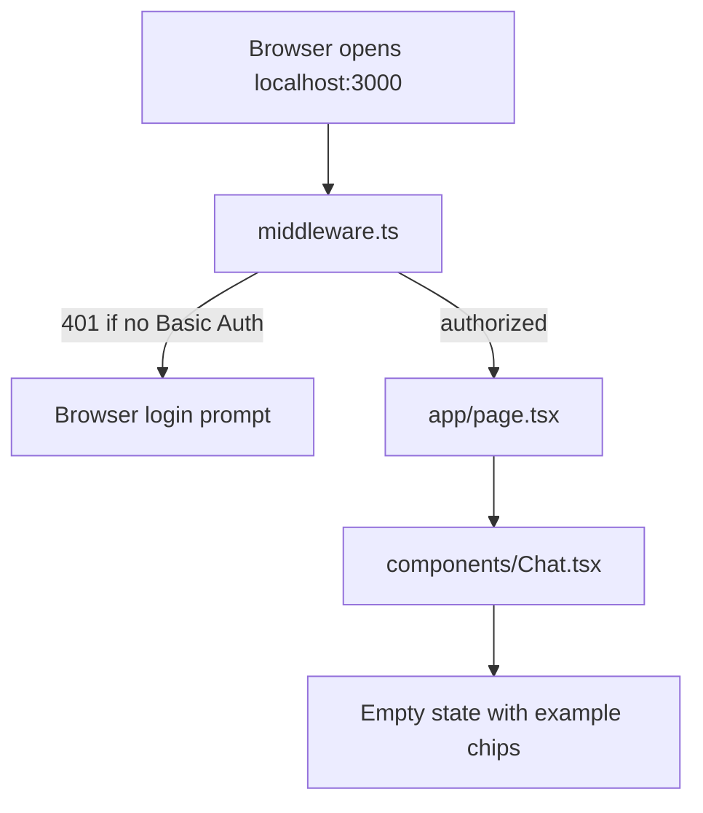
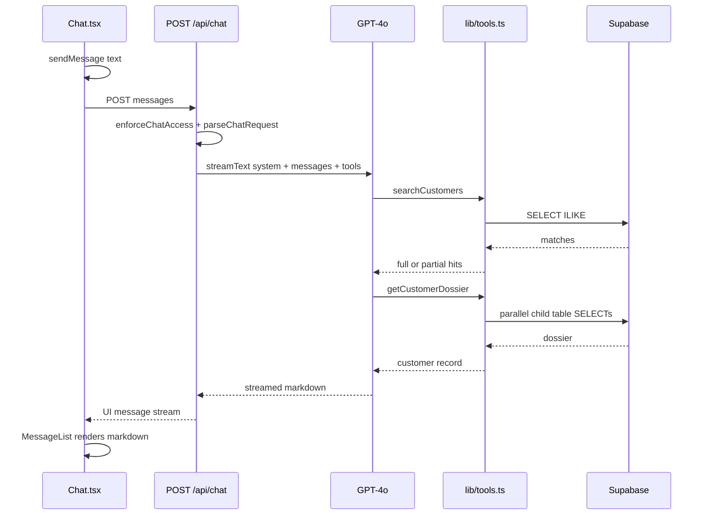

# Request flow

This page walks through what happens from opening the app to receiving the first answer.

## Startup

1. Next.js loads env vars from `.env.local`.
2. Middleware checks Basic Auth (`lib/access.ts`). Missing or wrong credentials → **401**.
3. `app/page.tsx` renders `Chat`.
4. `useChat()` initializes empty in-memory messages and `status: "ready"`.
5. The Supabase client is **not** created yet; it is created lazily on the first API request and then cached (`lib/supabase.ts`).

## First question

Example: “Tell me about Eleanor Shellstrop”.

### Frontend

1. `submitPrompt()` calls `sendMessage({ text })`.
2. The user message is added to local state immediately.
3. `useChat` POSTs the conversation (validated on the server; max 20 messages) to `/api/chat`.
4. While waiting:
   - `status === "submitted"` → “Searching the database…”
   - During streaming, if the assistant message has tool parts but no text yet → same indicator.

### Backend (`app/api/chat/route.ts`)

1. **`enforceChatAccess`** — Basic Auth + rate limit (defense in depth; middleware already checked).
2. **`parseChatRequest`** — Zod validation; keeps text parts only; rejects malformed bodies with **400**.
3. **`createServerSupabaseClient()`** — secret key client (bypasses RLS).
4. **`streamText`** — agentic tool loop with GPT-4o, capped at **5 steps** (`stopWhen: stepCountIs(5)`).
5. Response is a **UI message stream** consumed by `useChat`.

## Status codes at a glance

| Status | Meaning |
| --- | --- |
| 200 | Streaming success |
| 400 | Invalid JSON or invalid messages |
| 401 | Missing / wrong Basic Auth |
| 429 | Rate limit exceeded |
| 500 | Supabase client or stream setup failure |
