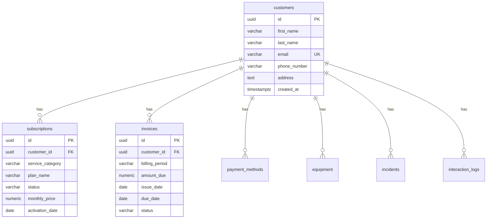

# Database schema

DataChat reads a telecom-style CRM in Supabase Postgres. All access goes through the server secret key.

## Entity relationship

## Tables

| Table | Purpose |
| --- | --- |
| `customers` | Identity (name, email, phone, address) |
| `subscriptions` | Service plans and status |
| `invoices` | Billing periods, amounts, paid/unpaid |
| `payment_methods` | Card / payment provider metadata |
| `equipment` | Devices, models, serials, warranty |
| `incidents` | Support issues and resolution |
| `interaction_logs` | Agent notes by channel |

All child tables are keyed by `customer_id` → `customers.id`.

## Row Level Security

RLS is **enabled** on every public table. With **no policies**, the browser/anon key cannot read anything.

The app uses `SUPABASE_SECRET_KEY` on the server only, which **bypasses RLS**. That is intentional: the chat tools need full read access, and the secret never ships to the client.

## Demo data

Typical sample customers:

- Eleanor Shellstrop
- Chidi Anagonye
- Tahani Al-Jamil

Madam Peterson is **not** present — useful for testing the no-match path.
