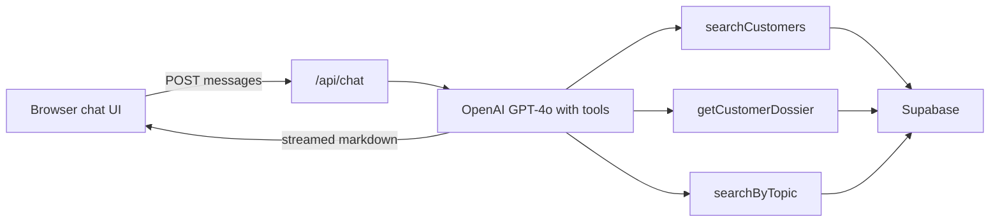

# DataChat

DataChat is a ChatGPT-style Q&A app over a telecom CRM stored in Supabase. Ask about a customer or topic; a server-side OpenAI agent searches the database and streams a structured summary.

The browser talks only to `/api/chat`. OpenAI and Supabase secret keys stay on the server. Access is gated with HTTP Basic Auth.

## What you can ask

Demo customers in the CRM:

- **Eleanor Shellstrop**
- **Chidi Anagonye**
- **Tahani Al-Jamil**

Example prompts:

- Tell me about Eleanor Shellstrop
- Show unpaid invoices
- What open incidents do we have?

There is no Madam Peterson in the data; that search should return a clear “no matching records” answer.

## How it works (high level)

The agent does **not** dump the whole database into the prompt. It searches first, loads only matching rows, then writes the summary.

## Documentation map

| Section | Description |
| --- | --- |
| [Getting started](getting-started.md) | Install, env vars, run locally |
| [Architecture](architecture/overview.md) | System design, request flow, agent loop |
| [Database](database/schema.md) | Schema, tools, data freshness |
| [Security](security.md) | Basic Auth, rate limits, secrets |
| [API](api/chat.md) | `POST /api/chat` contract |
| [Frontend](frontend/ui.md) | Chat UI components and UX |
| [Testing](testing.md) | Unit and integration tests |
| [Deployment](deployment.md) | Hosting the app and this docs site |

## Source code

Repository: [Hehodas/datachat](https://github.com/Hehodas/datachat)
